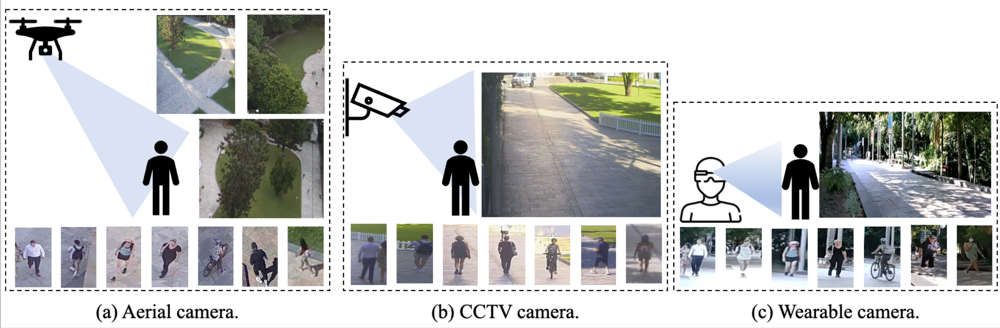
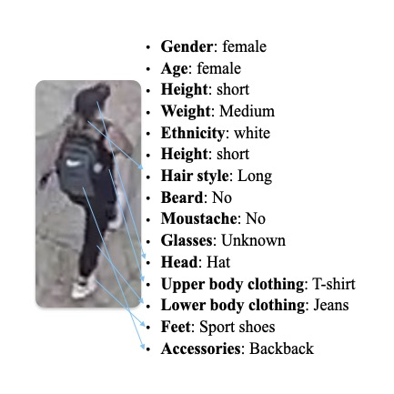

# AG-ReID.v2

**Official repository for TIFS2023: AG-ReID.v2: Bridging Aerial and Ground Views for Person Re-identification**



The evaluation code will be added soon.

## Paper

- [arXiv](https://arxiv.org/abs/2401.02634)

## News

- **2023-03-07**: The AG-ReID.v2 dataset is now available for [download](https://drive.google.com/drive/folders/16r7G_CuUqfWG6_UCT7goIGRMqJird6vK?usp=share_link).

## About the Dataset

We have annotated 15 attributes for the [AG-ReID.v2 dataset](https://drive.google.com/drive/folders/16r7G_CuUqfWG6_UCT7goIGRMqJird6vK?usp=share_link). The dataset comprises 807 distinct identities for training and another 808 for testing. These attributes are annotated at the identity level, which means that the file contains 15 x 807 attributes for training and 15 x 808 attributes for testing. In this context, the label "image_index" represents the identity. You can find these annotations in the file named qut_attribute_v8.mat.

The 15 attributes include:

| Attribute | Representation in File | Label |
| :-------: | :-------------------: | :---: |
| Gender | gender | male(0), female(1), unknown(2) |
| Ages | age | 0-11(0), 12-17(1), 18-24(2), 25-34(3), 35-44(4), 45-54(5), 55-64(6), >65(7), Unknown(8) |
| Height | height | Child(0), Short(1), Medium(2), Tall(3), Unknown(4) |
| Body Volume | weight | Thin(0), Medium(1), Fat(2), Unknown(3) |
| Ethnicity | ethnic | White(0), Black(1), Asian(2), Indian(3), Unknown(4) |
| Hair Color | haircolor | Black(0), Brown(1), White(2), Red(3), Gray(4), Occluded(5), Unknown(6) |
| Hairstyle | hairstyle | Bald(0), Short(1), Medium(2), Long(3), HorseTail(4), Unknown(5) |
| Beard | beard | Yes(0), No(1), Unknown(2) |
| Moustache | moustache | Yes(0), No(1), Unknown(2) |
| Glasses | glasses | Normal_glasses(0), Sunglasses(1), No(2), Unknown(3) |
| Head Accessories | head | Hat(0), Scarf(1), Neckless(2), Occluded(3), Unknown(4) |
| Upper Body Clothing | upper | T-shirt(0), Blouse(1), Sweater(2), Coat(3), Bikini(4), Naked(5), Dress(6), Uniform(7), Shirt(8), Suit(9), Hoodie(10), Cardigan(11), Unknown(12) |
| Lower Body Clothing | lower | Jeans(0), Leggins(1), Pants(2), Shorts(3), Skirt(4), Bikini(5), Dress(6), Uniform(7), Suit(8), Unknown(9) |
| Feet | feet | Sport_shoe(0), Classic_shoe(1), High_heels(2), Boots(3), Sandals(4), Nothing(5), Unknown(6) |
| Accessories | bag | Bag(0), Backpack(1), Handbag(2), Rolling_bag(3), Umbrella(4), Sportif_bag(5), Market_bag(6), Nothing(7), Unknown(8) |

Note that in the .mat file, the original 15 attributes have been transformed into 88 binary-encoded attributes. 

## Sample



## Dataset Download

The dataset is available for [Download](https://drive.google.com/drive/folders/16r7G_CuUqfWG6_UCT7goIGRMqJird6vK?usp=share_link) now!

## Annotations

ImageName: **P**0006**T**0214**A**0**C**0**F**1831.jpg

- **P**0001: (**P**ersonID) unique identity for the main subject in the current video
- **T**MMDD0/MMDD1: (**T**imestamp) timestamp of the video, indicating Month / Date / AM (MMDD0) or PM (MMDD1)
- **A**0/1/2: (**A**ltitude) indicates the altitude level - low (0), medium (1), or high (2)
- **C**0/2/3: (**C**amera) indicates the type of camera used - UAV - RGB (0) / Wearable - RGB (2) / CCTV - RGB (3)
- **F**2281: (**F**rame) represents a specific frame from the video

## Citation
```
@misc{nguyen2024agreidv2,
      title={AG-ReID.v2: Bridging Aerial and Ground Views for Person Re-identification}, 
      author={Huy Nguyen and Kien Nguyen and Sridha Sridharan and Clinton Fookes},
      year={2024},
      eprint={2401.02634},
      archivePrefix={arXiv},
      primaryClass={cs.CV}
}
```
## Contact

`thanhnhathuy.nguyen@hdr.qut.edu.au`