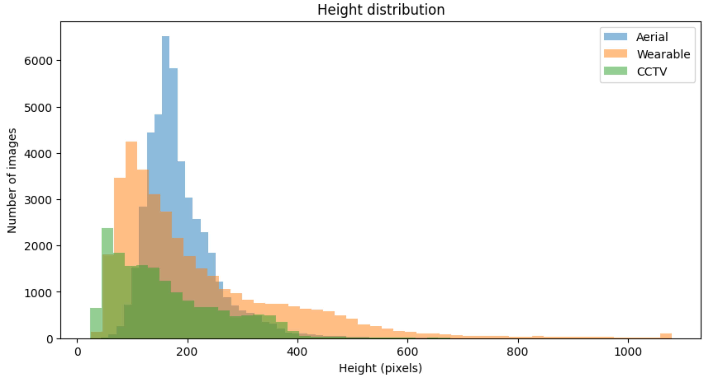

# AG-ReID.v2: Bridging Aerial and Ground Views for Person Re-identification


Welcome to the official repository for our paper "AG-ReID.v2: Bridging Aerial and Ground Views for Person Re-identification" published in TIFS2023. AG-ReID.v2 is a large-scale, multi-view person re-identification dataset that bridges the gap between aerial and ground perspectives.

## Highlights

- **Large-scale**: AG-ReID.v2 contains 100,502 images of 1,615 identities, making it one of the largest aerial-ground person ReID datasets.
- **Multi-view**: The dataset is captured from three different platforms - UAV, wearable cameras, and CCTV, providing a comprehensive view of the subjects.
- **Attribute-rich**: Each identity is annotated with 15 detailed attributes, enabling fine-grained analysis and attribute-based ReID.
- **Challenging**: AG-ReID.v2 presents real-world challenges such as occlusion, viewpoint variations, and background clutter.

## Download

The AG-ReID.v2 dataset is now available for download:

[Download AG-ReID.v2 Dataset](https://drive.google.com/drive/folders/16r7G_CuUqfWG6_UCT7goIGRMqJird6vK?usp=share_link)

## Dataset Overview

AG-ReID.v2 comprises 807 identities for training and 808 for testing. The dataset is annotated with 15 attributes at the identity level. You can find these annotations in the file `qut_attribute_v8.mat`.

### Attributes

| Attribute | Representation in File | Labels |
| :-------: | :-------------------: | :---: |
| Gender | gender | male(0), female(1), unknown(2) |
| Ages | age | 0-11(0), 12-17(1), 18-24(2), 25-34(3), 35-44(4), 45-54(5), 55-64(6), >65(7), Unknown(8) |
| Height | height | Child(0), Short(1), Medium(2), Tall(3), Unknown(4) |
| Body Volume | weight | Thin(0), Medium(1), Fat(2), Unknown(3) |
| Ethnicity | ethnic | White(0), Black(1), Asian(2), Indian(3), Unknown(4) |
| Hair Color | haircolor | Black(0), Brown(1), White(2), Red(3), Gray(4), Occluded(5), Unknown(6) |
| Hairstyle | hairstyle | Bald(0), Short(1), Medium(2), Long(3), HorseTail(4), Unknown(5) |
| Beard | beard | Yes(0), No(1), Unknown(2) |
| Moustache | moustache | Yes(0), No(1), Unknown(2) |
| Glasses | glasses | Normal_glasses(0), Sunglasses(1), No(2), Unknown(3) |
| Head Accessories | head | Hat(0), Scarf(1), Neckless(2), Occluded(3), Unknown(4) |
| Upper Body Clothing | upper | T-shirt(0), Blouse(1), Sweater(2), Coat(3), Bikini(4), Naked(5), Dress(6), Uniform(7), Shirt(8), Suit(9), Hoodie(10), Cardigan(11), Unknown(12) |
| Lower Body Clothing | lower | Jeans(0), Leggins(1), Pants(2), Shorts(3), Skirt(4), Bikini(5), Dress(6), Uniform(7), Suit(8), Unknown(9) |
| Feet | feet | Sport_shoe(0), Classic_shoe(1), High_heels(2), Boots(3), Sandals(4), Nothing(5), Unknown(6) |
| Accessories | bag | Bag(0), Backpack(1), Handbag(2), Rolling_bag(3), Umbrella(4), Sportif_bag(5), Market_bag(6), Nothing(7), Unknown(8) |

*Note: In the .mat file, the original 15 attributes have been transformed into 88 binary-encoded attributes.*

### Image Annotations

Image filenames in AG-ReID.v2 follow a specific format that encodes key information:
ImageName: **P**0006**T**0214**A**0**C**0**F**1831.jpg

- **P**0001: (**P**ersonID) unique identity for the main subject in the current video
- **T**MMDD0/MMDD1: (**T**imestamp) timestamp of the video, indicating Month / Date / AM (MMDD0) or PM (MMDD1)
- **A**0/1/2: (**A**ltitude) indicates the altitude level - low (0), medium (1), or high (2)  
- **C**0/2/3: (**C**amera) indicates the type of camera used - UAV - RGB (0) / Wearable - RGB (2) / CCTV - RGB (3)
- **F**2281: (**F**rame) represents a specific frame from the video

## Camera Specifications

| Device | Brand | Model | Resolution | FPS | Altitude |
|---|---|---|---|---|---|
| CCTV | Bosch | N/A | 800 x 600 | 30 | ~ 3m |
| Wearable | Vuzix | M4000 | 4K | 30 | ~ 1.5m |
| UAV | DJI | XT2 | 3840 x 2160 | 30 | ~ 15-45m |

## Data Collection Area

The dataset was collected in a diverse urban environment:
<div style="display: flex; justify-content: center;">

</div>

## Distribution of Body Heights

<div style="display: flex; justify-content: center;">
  
</div>


## Key Challenges

AG-ReID.v2 presents several real-world challenges for person re-identification algorithms:

<div style="display: flex; justify-content: center;">

</div>

1. **Viewpoint Variations**: Subjects are captured from multiple viewpoints, including aerial and ground perspectives.
2. **Occlusions**: Partial occlusions are common due to objects in the scene or other people.  
3. **Background Clutter**: Complex and varying backgrounds can confuse ReID models.
4. **Altitude Variations**: UAV captures subjects from different altitudes, leading to scale variations.

## Comparison with Other ReID Datasets

AG-ReID.v2 stands out among existing person ReID datasets in several aspects:

| Attributes | Market-1501 | DukeMTMC-reID | PRAI-1581 | UAV-Human | AG-ReID.v1 | AG-ReID.v2 (ours) |
| :-------: | :---: | :---: | :---: | :---: | :---: | :---: |
| \# IDs | 1,501 | 1,404 | 1,581 | 1,144 | 388 | **1,615** |
| \# Images | 32,668 | 36,411 | 39,461 | 41,290 | 21,983 | **100,502** |
| \# Attributes | ✗ | ✗ | ✗ | 7 | 15 | 15 |
| Backgrounds | ✗ | ✗ | ✗ | ✓ | ✓ | ✓ |
| Occlusion | ✗ | ✗ | ✓ | ✓ | ✓ | ✓ |
| Camera Views | fixed | fixed | mobile | mobile | mixed | mixed | 
| Platforms | CCTV | CCTV | UAV | UAV | Dual | **Triple** |
| Altitude | $<10m$ | $<10m$ | $20\sim60m$ | $2\sim8m$ | $15\sim45m$ | $15\sim45m$ |
| \# UAVs | 0 | 0 | 2 | 1 | 1 | 1 |

AG-ReID.v2 leads in the number of identities, images, and platforms compared to other ReID datasets. 

## Comparative Analysis of Attributes

| Attributes | Market-1501 | DukeMTMC-reID | P-DESTRE | UAV-Human | AG-ReID.v1 | AG-ReID.v2 (ours) |
| :-------: | :---: | :---: | :---: | :---: | :---: | :---: |
| Gender | ✓ | ✓ | ✓ | ✓ | ✓ | ✓ |
| Age | ✗ | ✗ | ✓ | ✗ | ✓ | ✓ | 
| Height | ✗ | ✗ | ✓ | ✗ | ✓ | ✓ |
| Body Volume | ✗ | ✗ | ✓ | ✗ | ✓ | ✓ |
| Ethnicity | ✗ | ✗ | ✓ | ✗ | ✓ | ✓ |
| Hair Color | ✗ | ✗ | ✓ | ✗ | ✓ | ✓ |
| Hairstyle | ✗ | ✗ | ✓ | ✗ | ✓ | ✓ |
| Beard | ✗ | ✗ | ✗ | ✗ | ✓ | ✓ |
| Moustache | ✗ | ✗ | ✗ | ✗ | ✓ | ✓ |
| Glasses | ✗ | ✗ | ✓ | ✗ | ✓ | ✓ |
| Head Accessories | ✗ | ✗ | ✓ | ✗ | ✓ | ✓ |
| Upper Body Clothing | ✓ | ✓ | ✗ | ✓ | ✓ | ✓ |
| Lower Body Clothing | ✓ | ✓ | ✗ | ✓ | ✓ | ✓ |  
| Feet | ✗ | ✗ | ✓ | ✗ | ✓ | ✓ |
| Accessories | ✓ | ✓ | ✓ | ✓ | ✓ | ✓ |

## Citation
If you find AG-ReID.v2 useful in your research, please consider citing our paper:

```bibtex
@ARTICLE{10403853,
  author={Nguyen, Huy and Nguyen, Kien and Sridharan, Sridha and Fookes, Clinton},
  journal={IEEE Transactions on Information Forensics and Security}, 
  title={AG-ReID.v2: Bridging Aerial and Ground Views for Person Re-Identification}, 
  year={2024},
  volume={19},
  number={},
  pages={2896-2908},
  keywords={Cameras;Autonomous aerial vehicles;Image resolution;Computer architecture;Smart glasses;Meters;Drones;Person re-identification;aerial-ground imagery;UAV;CCTV;smart glasses;video surveillance;attribute-guided;three-stream network},
  doi={10.1109/TIFS.2024.3353078}}
